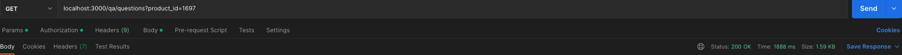
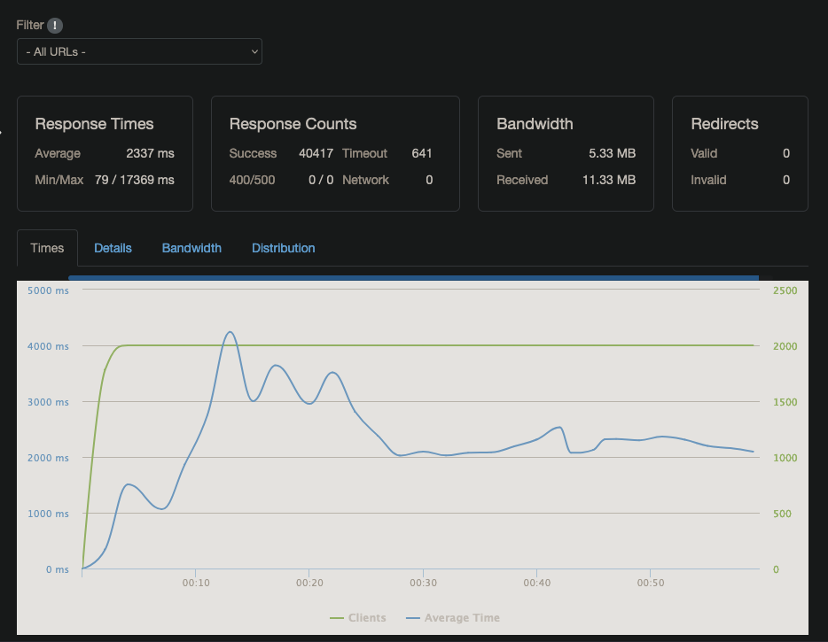
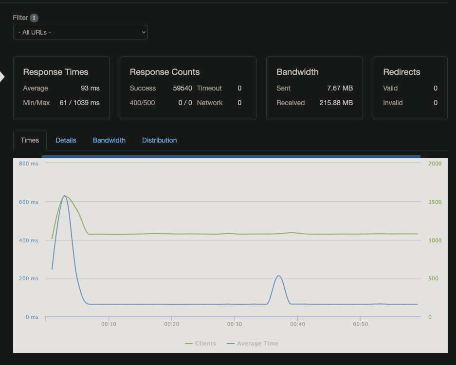

# Performance Notes

This service was developed as a systems design project for a Questions and Answers API. The engineering journal in `artifacts/engineering-journal.md` records the performance work: baseline route testing, PostgreSQL indexing, Redis caching, Docker deployment, and Loader.io experiments across several deployment layouts.

## Baseline Query Latency

Initial Postman checks showed the `/qa/questions` endpoint was functional but slow against the loaded PostgreSQL dataset. One captured request for `product_id=1697` returned successfully in about `1888 ms`.

## PostgreSQL Indexing

The first major optimization was adding database indexes for the hot query path. After indexing, the same `/qa/questions` request returned in about `211 ms` in the captured Postman test.

The journal also records k6 stress testing before and after indexing. At the highest local stress level, the service reached timeout/failure conditions around `10000` virtual users.

After indexing, the k6 run recorded a high success rate under the same endpoint test, while still showing the service approaching its local saturation point.

## Redis Caching

Redis was added through Docker Compose and then integrated into the Express server as a cache for repeated query results. The journal notes that local tests appeared slightly faster with caching, but the bigger value became visible in repeated Loader.io tests.

In the strongest captured cached Loader.io result, the service handled `10000 clients over 1 min` with `10000` successful responses, `0` timeouts, and an average response time of about `62 ms`.

## Deployment Layout Experiments

The journal documents several EC2 deployment experiments:

- Single server running API, cache, and database.
- Split deployment with cache/database on one server and backend on another.
- Split deployment with cache colocated with backend and database on a separate server.
- Split deployment with no cache.

The no-cache split deployment performed substantially worse, with a captured average response time above `2 s`.

Moving the cache into the backend server improved results, supporting the journal's conclusion that network hops between backend and cache/database affected latency.

The single-server/no-split layout remained competitive in the captured tests, which suggested that horizontal scaling would need careful placement of cache and database connections to outperform the simpler deployment.

## Takeaways

- PostgreSQL indexing provided the largest direct improvement for slow route responses.
- Redis caching improved repeated-request performance, especially when cache and backend were colocated.
- Splitting services across EC2 instances introduced latency tradeoffs; separating database from backend/cache was more effective than separating cache from backend.
- Loader.io and k6 were both useful: k6 exposed local saturation behavior, while Loader.io provided hosted load-test evidence for deployed configurations.
